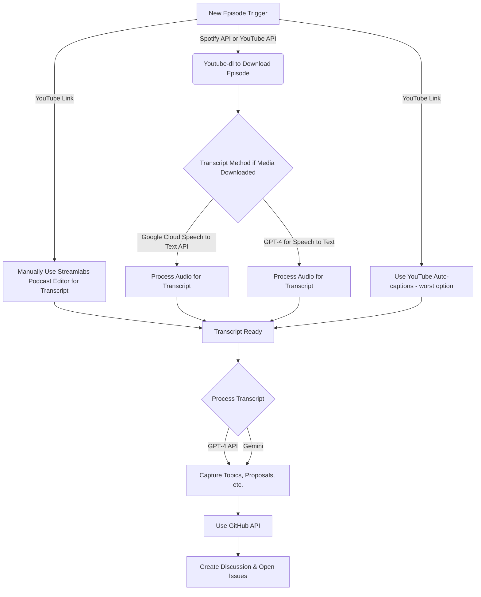

# Nodes and Biscuits Forum
## Welcome

This repo serves to automatically capture and process a transcript of the podcast, which would be useful to   
- provide a community feedback loop to the [Godot Engine](https://github.com/godotengine/godot) project  
- Improvement proposals,   
- context to the issues discussed on the podcast

Below you will find the proposed workflow and below that a [sample](https://github.com/444B/nodes-and-biscuits-forum/edit/main/README.md#nodes-and-biscuits-a-dive-into-godot-plugins-and-game-development-insights) of a processed episode

# Proposed Workflow for Podcast Processing
This document outlines the workflow for processing podcast episodes, from obtaining the media to posting discussions and issues on GitHub based on the content.

## Workflow Diagram

## Step 1: Getting Media
- **Spotify API**: Triggered by new podcast episode availability. [Spotify for Developers](https://developer.spotify.com/documentation/web-api/)
- **YouTube API**: Triggered by new podcast episode availability. [YouTube Data API](https://developers.google.com/youtube/v3)
- **Youtube-dl**: Used to download episodes from YouTube for further processing. [Youtube-dl](https://github.com/ytdl-org/youtube-dl)

## Step 2: Getting Transcript
- **Streamlabs Podcast Editor**: Manual transcription service that works with a YouTube link. [Streamlabs](https://streamlabs.com/)
- **Google Cloud Speech to Text API**: Automatically processes audio for transcripts if a direct transcript isn't available. [Google Cloud Speech-to-Text](https://cloud.google.com/speech-to-text)
- **GPT-4 for Speech to Text**: An alternative automated transcript method using GPT-4. [OpenAI GPT-4](https://openai.com/api/)
- **YouTube Auto-captions**: Least desired due to lower quality. [YouTube Automatic Captions](https://support.google.com/youtube/answer/6373554)

## Step 3: Processing
- **GPT-4 API**: Processes the transcript file to capture topics discussed, proposals, etc. [OpenAI GPT-4](https://openai.com/api/)
- **Gemini**: An alternative processing method (hypothetical, replace with actual link if applicable).

## Step 4: Posting
- **GitHub API**: Publishes content to the repository as a discussion and opens issues for any topics discussed. [GitHub REST API](https://docs.github.com/en/rest)

---

---

## Sample of a processed episode
Processed using streamlabs to capture transcript and ChatGPT4 to create generate .md 

 
Prompt used

I have an audio transcript.
Please process it and provide it back to me as an .md file with the following sections
# Title, date
## TLDR
## Topics discussed
## Issues or proposals mentioned which are relevant to Godot
## Other points

# Nodes and Biscuits: A Dive into Godot Plugins and Game Development Insights
**Date:** [Insert Date of Podcast Here]

## TL;DR
- Christoph Klestil and Big Brain discuss the intricacies of developing plugins for the Godot Engine.
- Topics include the creation of Behave and Pandora plugins, game development processes, and insights into Godot's community and future directions.
- Focus on issues and proposals relevant to Godot, including plugin development challenges and strategies for effective community engagement.

## Topics Discussed
- **Plugin Development in Godot:** Big Brain shares his journey into Godot plugin development, highlighting the Behave and Pandora plugins. Behave allows designing behavior trees in the editor, while Pandora simplifies handling RPG data at scale.
- **Community Engagement and Support:** The challenges of maintaining popular plugins, such as Behave, which has garnered significant attention and use within the Godot community.
- **Game Development Processes:** Insights into Big Brain's current game project and his approach to game development, including naming conventions, storytelling, and creating immersive worlds.
- **Future Directions for Godot:** Discussion on the evolution of Godot, addressing both its strengths and areas for improvement, particularly in terms of UI/UX design and plugin support.

## Issues or Proposals Mentioned Relevant to Godot
- **Enhancing Plugin Support:** The conversation touches on the need for better support and documentation for plugin developers in Godot to foster a more vibrant ecosystem.
- **Godot Version Compatibility:** Big Brain mentions the importance of ensuring plugins remain compatible with new versions of Godot, suggesting more streamlined processes or tools for plugin developers to manage version transitions.

## Other Points
- **The Power of Community:** Both speakers emphasize the importance of community feedback in the development of plugins and games. They discuss how engaging with the community can lead to better software solutions and more enjoyable game experiences.
- **Challenges of Indie Game Development:** Insights into the balancing act of indie game development, including time management, prioritizing features, and dealing with the uncertainties of creative endeavors.
"""
